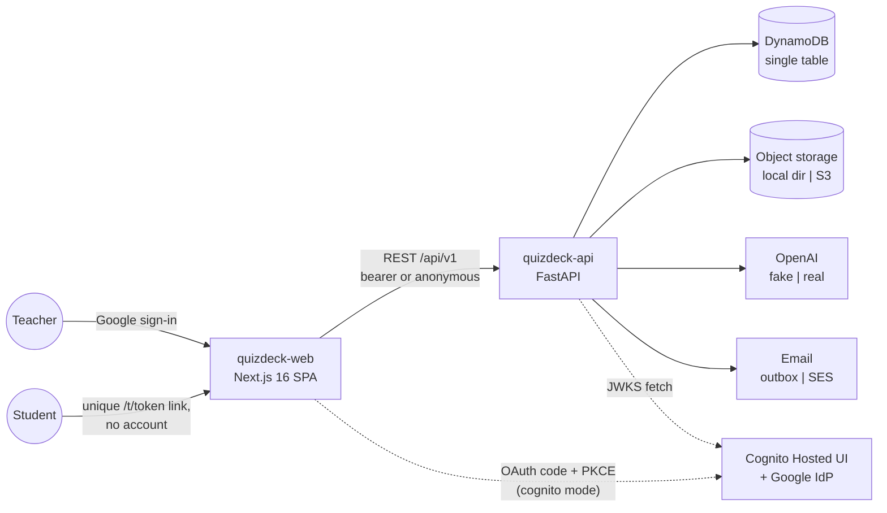
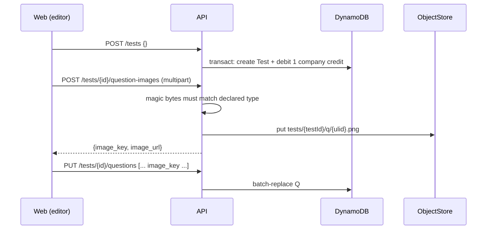

# QuizDeck — High-Level Design

*Accurate as of 2026-08-07. Companion documents: [LLD.md](LLD.md) (per-feature
low-level design), [dynamodb-schema.md](dynamodb-schema.md) (storage layout),
[llm-pipeline.md](llm-pipeline.md) (AI generation and PDF extraction),
[aws-setup.md](aws-setup.md) (provisioning real AWS).*

## 1. What the product is

Teachers author timed multiple-choice tests — by hand or with AI — invite
students by email, and review results. Students take a test through a unique
link with no account of any kind.

Every question is the same shape: a rich-text stem, an optional image, exactly
four options, exactly one correct. That uniformity is load-bearing: it is what
makes grading pure, analytics cheap, and AI output verifiable.

## 2. System context



Two repositories, deployed independently:

| Repo | Stack | Role |
| --- | --- | --- |
| `quizdeck-web` | Next.js 16, Tailwind v4, TanStack Query, Tiptap, shadcn-on-Base-UI | All UI. Calls the API from the browser; no server actions, no route handlers. |
| `quizdeck-api` | FastAPI, Pydantic v2, boto3 | All business logic, persistence, AI calls, email. |

## 3. The five swappable edges

Every external dependency sits behind a Protocol with a real and a fake
implementation, chosen **once at startup** from `Settings`
(`app/core/config.py`). There is no `if DEBUG` anywhere; fakes are
lazy-imported so production never loads them, and `Settings` **refuses to
boot** with `APP_ENV=prod` plus any fake mode.

| Edge | Switch | Real | Dev fake | Fake behaviour |
| --- | --- | --- | --- | --- |
| Auth | `AUTH_MODE` | Cognito JWT verify (JWKS, RS256, iss/aud/exp) | `FakeVerifier` | any `dev-<name>` bearer is teacher `<name>` |
| Email | `EMAIL_MODE` | SESv2 `send_email` | `OutboxEmailSender` | one JSON file per mail, listed by `GET /dev/outbox` |
| LLM | `LLM_MODE` | OpenAI structured outputs | `FakeMCQGenerator` / `FakeQuestionExtractor` | deterministic questions with tell-strings |

**Storage has no fake, and that is a deliberate asymmetry.** DynamoDB Local,
MinIO and the local-filesystem object store were all removed: none of them
touched the real client, so none could catch a bucket, credential, IAM or
content-type mistake — the failures that actually happen. Isolation comes from
*separate real resources* instead, one pair per environment:

| | `.env.dev` (default) | `.env.prod` |
| --- | --- | --- |
| table | `quizdeck-dev` | `quizdeck-prod` |
| bucket | `quizdeck-media-dev` | `quizdeck-media` |

Cognito and SES are shared across both. A dev box therefore needs real AWS
credentials (a named `~/.aws` profile), but no docker and no emulator. The test
suite needs neither: it intercepts boto3 in-process with `moto`.

## 4. Feature inventory

| Feature | Endpoints | Notes |
| --- | --- | --- |
| Teacher identity & tenancy | `GET /me` | Upserts the teacher from token claims; provisions their Company (credits + AI credits) on first call; backfills legacy records. |
| Test CRUD | `POST/GET /tests`, `GET/PATCH/DELETE /tests/{id}` | Draft-only mutation; publishing freezes a test. |
| Question authoring | `PUT /tests/{id}/questions` | Whole-list replace. Stems are sanitized Tiptap HTML; per-question optional image. |
| Question images | `POST /tests/{id}/question-images`, `GET /images/{key}` | Multipart upload with magic-byte validation; anonymous serve route (students have no token). |
| AI generation | `POST /tests/generate` | Topic + rich-text guidelines + optional source document. Spends 1 test credit + 1–2 AI credits atomically. |
| Knowledge base | `POST /knowledge-base`, `GET /knowledge-base/{key}` | Uploads a PDF/image/txt/md, stores it, reads its text server-side (vision only where unavoidable). Owner-only. |
| In-editor generation | `POST /tests/{id}/generate-questions` | Drafts questions without persisting; currently no UI caller. |
| Rostering & invites | `POST/GET /tests/{id}/students`, `POST /tests/{id}/publish` | Sessions + unguessable link tokens; invitations sent on publish (or immediately if already published). |
| Student take flow | `GET /take/{token}`, `POST /take/{token}/start`, `POST /take/{token}/submit` | Fully anonymous; server-time-only; idempotent start; atomic submit+complete. |
| Results | `GET /tests/{id}/students/{session}`, `GET /tests/{id}/analytics` | Per-student review and aggregate analytics, computed on read. No stored aggregates. |
| Support | `POST /support` | Emails the configured support inbox. |
| Dev tooling | `GET /dev/outbox` (dev only) | Mock inbox for invitation links. |

Scripts (operational, not routed): `create_table.py`, `seed.py`,
`grant_credits.py`, `extract_pdf.py` (run the PDF extraction pipeline against a
file), `seed_from_pdf.py` (persist an extraction as a real test).

## 5. Core data flows

### 5.1 Teacher authentication (cognito mode)

Browser-side OAuth code + PKCE against the Cognito Hosted UI (Google IdP);
the SPA holds the **ID token** and sends it as a bearer. The API verifies
signature/issuer/audience/expiry against the pool's JWKS (cached ~5 min) and
maps claims → `TeacherClaims{sub, email, name}`. The `sub` is the ownership key
for everything the teacher touches.

### 5.2 Authoring



The image key is minted against the **test**, not the question, because every
save re-mints all `question_id`s; the editor round-trips `image_key` back on
each save, so images survive re-saves untouched.

### 5.3 AI generation

One synchronous request. If a source document is attached, the browser holds
the `File` locally and uploads it **only when Generate is clicked** — reading a
document can cost a vision call, so nothing is read (or stored) speculatively.

```
pick file (browser only) ──Generate──▶ POST /knowledge-base   (store + read text)
                                        POST /tests/generate  (topic, guidelines,
                                                               kb text, kb key)
                                              │  check both credit pools
                                              │  LLM call (structured outputs)
                                              │  re-check credits
                                              ▼
                                        transact: Test + debit(1 credit, 1–2 AI credits)
                                        batch-write questions ──▶ editor
```

Details, prompts, and the PDF extraction pipeline: [llm-pipeline.md](llm-pipeline.md).

### 5.4 Invite → take → results

```mermaid
sequenceDiagram
    participant T as Teacher
    participant A as API
    participant S as Student
    T->>A: POST /tests/{id}/students (roster)
    A->>A: create Session + TOKEN lookup per student (one batch)
    T->>A: POST /tests/{id}/publish {deadline}
    A->>A: status=published, email each invitee their /t/{token} link
    S->>A: GET /take/{token} (anonymous)
    S->>A: POST /take/{token}/start
    A->>A: session started, ends_at = now + duration (server clock)
    S->>A: POST /take/{token}/submit {answers}
    A->>A: grade server-side; transact: Submission + session→completed
    T->>A: GET /tests/{id}/students/{session} (review, has answers)
```

The link token (`secrets.token_urlsafe(24)`, ~144 bits) is the student's entire
credential. Timing decisions use the server clock only; the client receives
`server_now` and computes an offset for its countdown display.

## 6. Security model

The rules are written down in `CLAUDE.md` and enforced by tests; the important
ones and their mechanisms:

| Property | Mechanism |
| --- | --- |
| Tenant isolation | Ownership comes from the partition key (`TEACHER#<sub>/TEST#<id>`), never from a field check. Someone else's resource **misses** (404), and the response never reveals whether it exists. Same posture for knowledge-base files (owner-hashed key prefix, pure string compare). |
| Students never see answers | `correct_index` exists on no model reachable from `app/schemas/take.py`; a recursive-walk unit test enforces it (and now also bans `image_key`). Responses are separate models, never runtime key-stripping. |
| Stored XSS | Stems render via `dangerouslySetInnerHTML`, so every stem — teacher-typed or LLM-produced — passes through `sanitize_rich_text` (bleach, 8-tag allow-list, zero attributes) **before persistence**. Options render as React text children and are never HTML. |
| Uploaded-file safety | Declared content type is treated as a claim: magic bytes must match; SVG is excluded (script-capable); the serve route re-validates keys against an allow-list regex before touching storage, derives `Content-Type` from the key we minted, and sends `nosniff`. |
| Prompt injection | Untrusted document text is fenced with a per-request nonce; instruction hierarchy in the system prompt; structural markers defanged. The hard boundaries are the response schema and the sanitizer — prompt-level defences are treated as soft. |
| Payload bounds | 1 MB body cap on every JSON route (upload routes get their own explicit ceiling, re-enforced while streaming because Content-Length can lie); field-level caps bound DynamoDB item size. |
| Env safety net | `Settings` refuses to construct in prod with any fake mode or any local credential profile (a container has no `~/.aws`), refuses in dev with a `*-prod` table or bucket name, and refuses anywhere without both resource names. With no local mode left, a misconfigured box no longer fails loudly against a dead localhost port — it would succeed against the wrong real account, so the guard is explicit. |

Accepted risks, stated rather than hidden: image URLs are permanent unguessable
capabilities (same posture as attempt link tokens); removed/abandoned images
leak in storage (no reaper yet — deliberately, `s3:ListBucket` is withheld);
no rate limiting exists anywhere.

## 7. Credits and tenancy

Companies hold balances, not teachers. Two pools on the same Company item:

- **Test credits** — every test costs 1, however created.
- **AI credits** — an AI run additionally costs 1 (prompt-only) or 2
  (document-grounded, because reading the file may itself cost a vision call
  and the prompt is far larger). Mode is *derived* from the request, never
  client-declared.

Both debits land in one `model_copy` on one item inside the same DynamoDB
transaction that creates the test — a crash can never spend one pool without
the other, or spend anything without producing a test. Prices are served on
`GET /me` so the UI never hardcodes them.

## 8. Consistency model

- **Optimistic locking** everywhere: every item carries a top-level `version`;
  writes are conditional (`version = :v`) and a losing race is a 409.
- **Two transactions** in the whole system, both the same shape (one new item
  + one versioned update): test-creation + credit debit, and submission +
  session completion. Everything else is single-item or batch.
- **Derived state is computed on read, never written back**: a session's
  `expired` / `link_expired` presentation is a projection over stored status +
  server time. No cron jobs, no background writes.
- **Denormalized counters** (`question_count`, `student_count` on Test) are
  updated in the same request that changes the underlying rows.

## 9. Known gaps / deferred work

- **Async PDF extraction job is not wired.** The full pipeline (extract a
  paper's questions, answers, and diagrams into a test) exists and is verified
  against a real JEE paper, but runs via scripts; `POST /tests/generate` is
  synchronous and uses extracted *text* only. The designed job model
  (statuses on Test, progress text, read-path timeout, dashboard polling) is
  documented in the implementation plan and unbuilt.
- `POST /tests/{id}/generate-questions` has no UI caller (intended for
  in-editor "generate more").
- `knowledge_base_key` is validated and priced but not persisted on the Test,
  so a test cannot yet link back to its source document.
- If a knowledge-base upload succeeds but generation then fails, the read cost
  was paid without a credit spend (small residual of a much larger hole that
  was closed by uploading only on Generate).
- Question count/difficulty are fixed contracts (default 10 / medium);
  guidelines cannot change how many questions come back.
